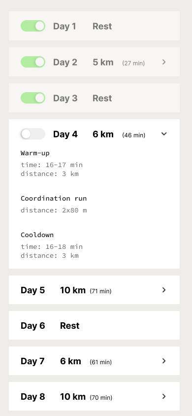
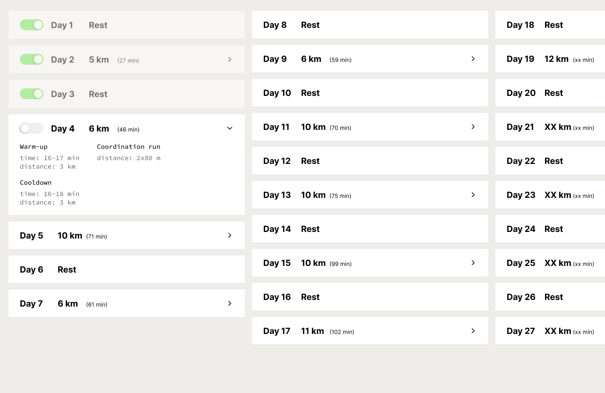

# H&M Group: Portfolio Brands

## Code Assessment for Half-Marathon Training Program

In collaboration with a running coach, we've designed a program to help individuals complete a half-marathon at an impressive pace. We are seeking your expertise to develop the frontend for this program. Additionally, we recommend storing its data in a database; there are many free solutions available.

## Host and demo

The built version should be deployed on any hosting solution of your choice and a link provided for us to test.
Vercel and Netlify both provide small free versions, but any type of hosting provider is fine.

## User Journey

Upon initiating the program, users will automatically receive a daily running routine. After completing each run, users can toggle a switch to mark the run as "Done." Once this status is confirmed, the toggle turns green but remains undimmed. The last completed run will only appear dimmed after the user reloads the page.

## UX Requirements

- Each run, except those designated as "Rest," should be expandable through an accordion UI component.
- When a user returns to the app, the next run in the sequence (i.e., the last completed run + 1) should be ready for toggling. If it's an accordion, it should be in the open state.
- The run designated for the current day is always determined by the last completed run + 1.
- Previous runs should appear dimmed but remain clickable, allowing users to reset their completion status if needed.

### Data Source

The `runs.json` file will serve as the primary data source. Feel free to restructure this file to better suit your development needs.

Updates to the data upon run completion can be handled purely in the browser. However, a more robust solution would be to store this information in a database of your choice.

```json
[
  {
    "name": "Day 7",
    "time": "71 min",
    "distance": 10,
    "completion": false, // Suggested method for tracking completion status
    "step": [
      {
        "time": "52-61 min",
        "title": "Long run at an easy pace",
        "distance": "10 km"
      },
      {
        "time": "5-10 min",
        "title": "Dynamic stretching"
      }
    ]
  }
]
```

### Mobile

In mobile view all runs are simply listed vertically
Breakpoint ends at 767px.



### Desktop

In desktop view, the runs stack in columns, changing depending on the height of the viewport. The user then scrolls horizontally to see them all.
Breakpoint starts at 768px.



## Technical Requirements

- Use the [Figma](https://www.figma.com/file/Jxnc0GcWfB3Gs3dZ8KcmlU/CODE-Test-21k?type=design&node-id=0%3A1&mode=design&t=sqHsEXIWCKLxwJL3-1) for precise UI
- Utilise the data and relevant fields from runs.json.
- The fonts in use are Google fonts and can be seen in Figma
- Headless UI libraries such as Radix, Headless UI, or Shadcdn are permissible, provided they are easily decoupled and replaceable.
- If the project requires credentials, communicate them to us directly via message or provide a .env.example file.
- Implement the design using React and TypeScript.
- Accessibility is a priority.
- High performance and Lighthouse scores are crucial. Given the absence of images, a score near 100% is achievable.
- Maintain a clean and modular code structure for easy reusability.
- You may use either app routes or page routes in Next.js, but do not mix the two.
